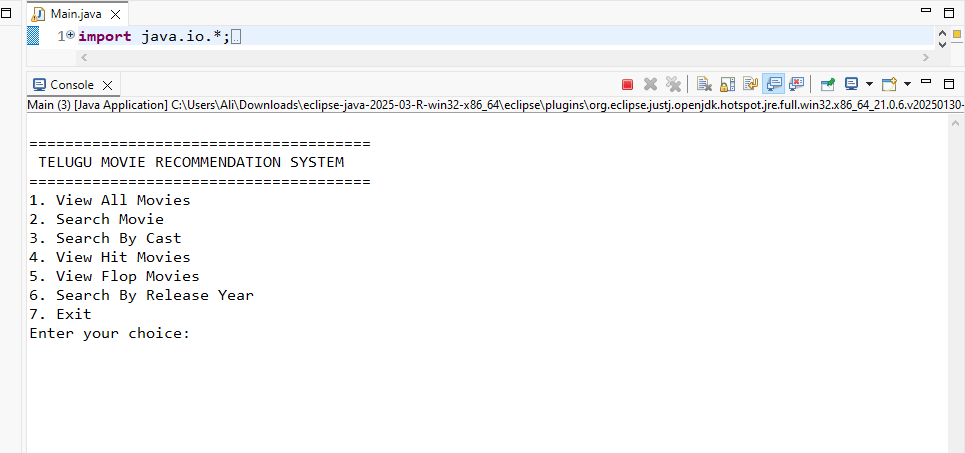
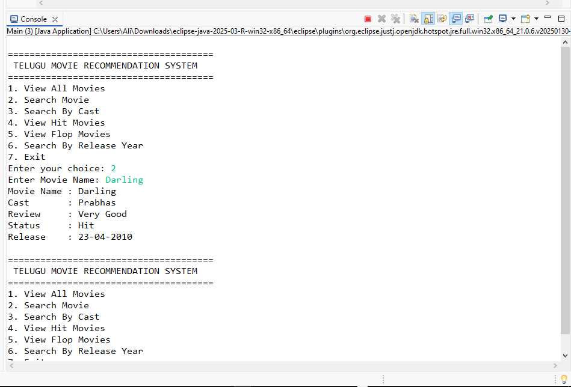
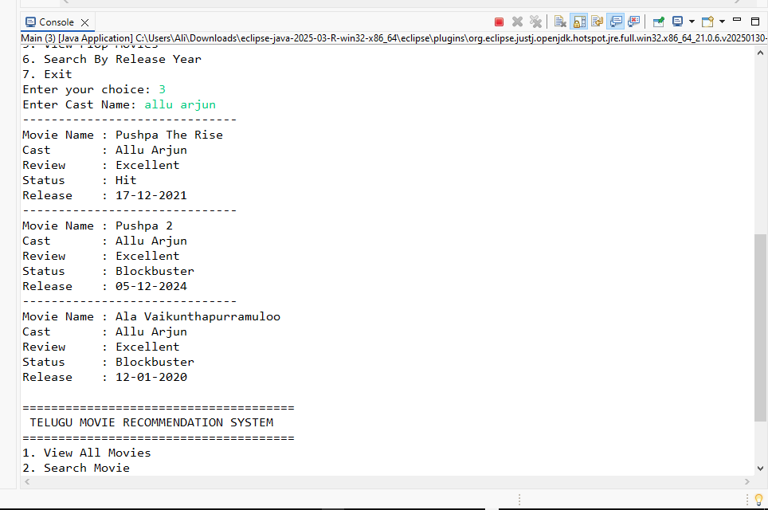
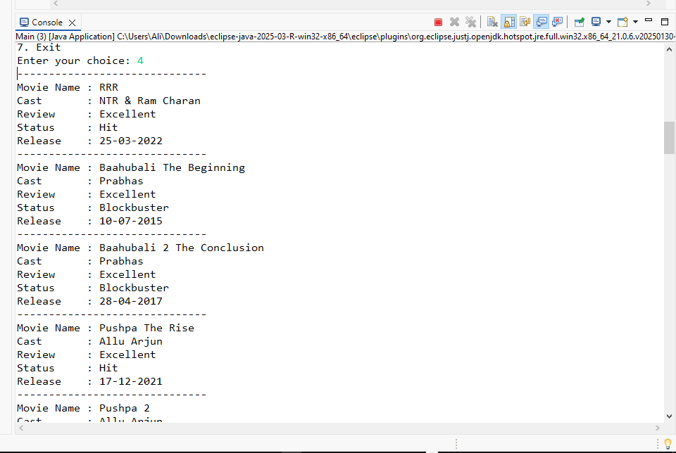
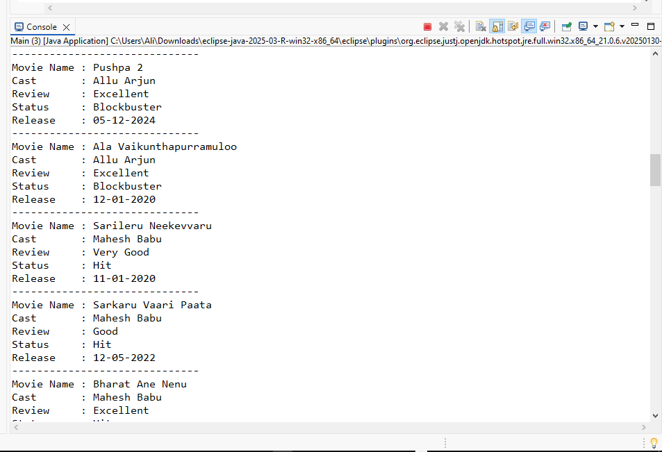
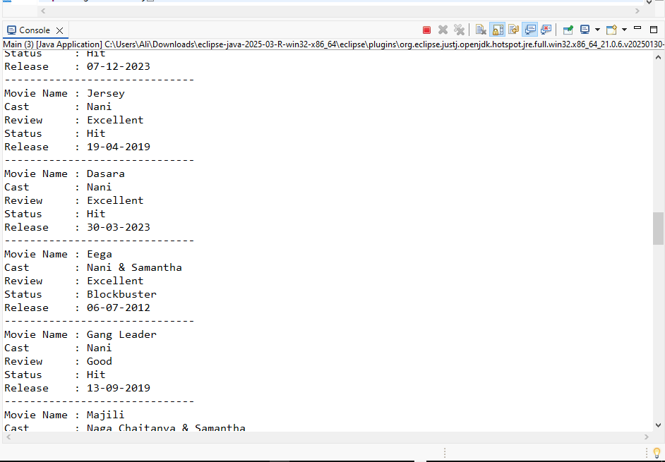
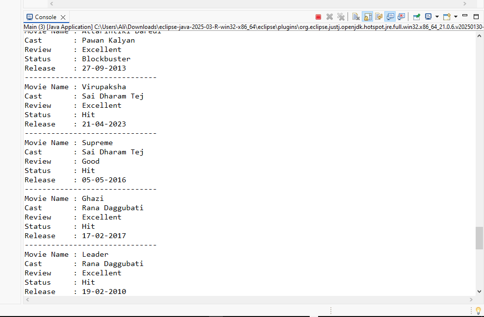
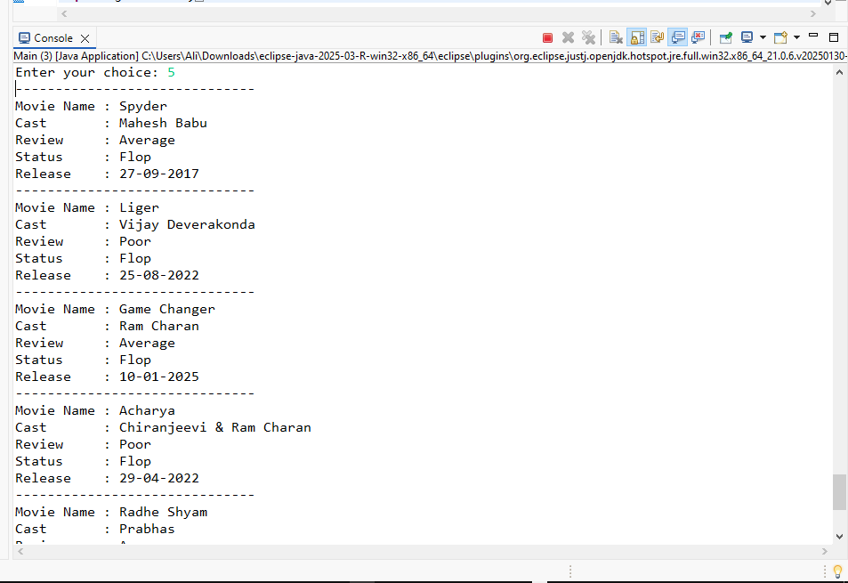
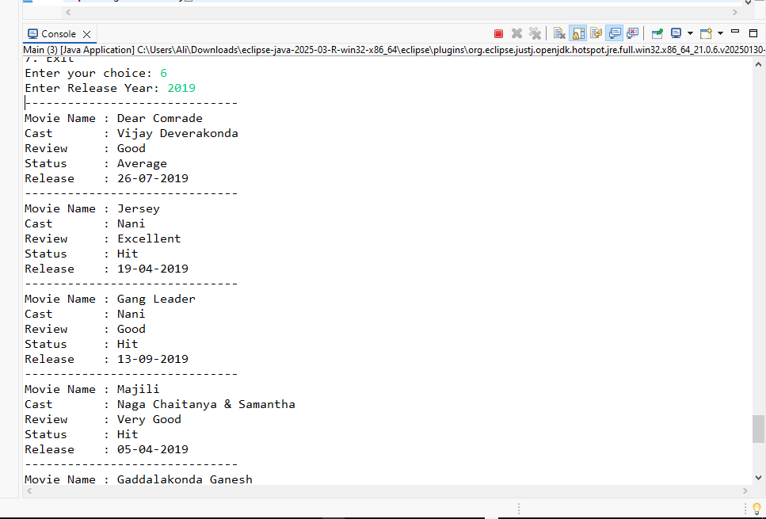
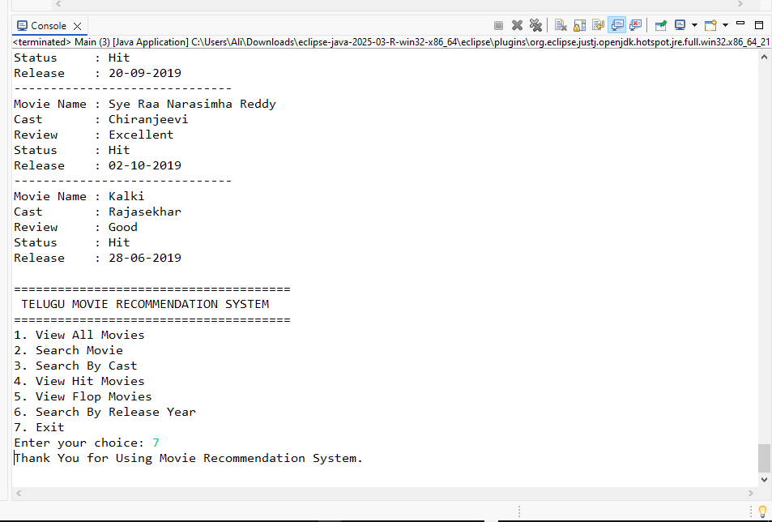

# 🎬 Movie Recommendation System Using Basic Filtering

## 📖 Project Description

The **Movie Recommendation System Using Basic Filtering** is a Java-based console application that recommends Telugu movies based on user preferences. The system reads movie data from a CSV dataset and provides features to search movies by title, cast, and release year, while also displaying Hit, Blockbuster, and Flop movies. This project demonstrates Java programming, Object-Oriented Programming (OOP), CSV file handling, and basic filtering techniques.

---

# 🎯 Objectives

* Develop a console-based movie recommendation system using Java.
* Implement basic filtering techniques for movie recommendations.
* Read and process movie information from a CSV dataset.
* Allow users to search movies by different criteria.
* Demonstrate Object-Oriented Programming concepts.
* Build a beginner-friendly recommendation application.

---

# ✨ Features

* 🎬 View all movies
* 🔍 Search movies by name
* 🎭 Search movies by cast
* ⭐ View Hit & Blockbuster movies
* ❌ View Flop movies
* 📅 Search movies by release year
* 📂 Read movie data from a CSV file
* 💻 Interactive console-based interface
* 📚 Object-Oriented Programming implementation

---

# 🛠 Technologies Used

| Technology    | Purpose                     |
| ------------- | --------------------------- |
| Java          | Programming Language        |
| Eclipse IDE   | Development Environment     |
| CSV File      | Movie Dataset Storage       |
| ArrayList     | Store Movie Objects         |
| OOP           | Object-Oriented Programming |
| File Handling | Read Movie Dataset          |

---

# 📁 Project Structure

```text
Movie-Recommendation-System/
│
├── Main.java
├── Movie.java
├── MovieDatabase.java
├── RecommendationEngine.java
├── CSVReader.java
├── data/
│   └── movies.csv
├── images/
│   ├── Project Structure.png
│   ├── Search Movie.png
│   ├── Search By Cast.png
│   ├── View Hit Movies.png
│   ├── View Hit Movies.png
│   ├── View Hit Movies.png
│   ├── View Hit Movies.png
│   ├── View Flop Movies.png
│   ├── Search By Release Year.png
│   └── Exit.png
└── README.md
```

---

# 📂 File Details

### 📌 Main.java

* Displays the application menu.
* Accepts user input.
* Controls the complete application flow.
* Calls recommendation methods.

### 📌 Movie.java

Stores movie details:

* Movie Name
* Cast
* Review
* Status
* Release Date

### 📌 MovieDatabase.java

* Reads the dataset.
* Creates movie objects.
* Stores movie records in an ArrayList.

### 📌 RecommendationEngine.java

Implements:

* View All Movies
* Search Movie
* Search by Cast
* View Hit Movies
* View Flop Movies
* Search by Release Year

### 📌 CSVReader.java

Reads movie data from the CSV file.

### 📌 movies.csv

Contains the Telugu movie dataset used by the application.

---

# ⚙️ How It Works

1. Load movie records from **movies.csv**.
2. Store all movies in an ArrayList.
3. Display the main menu.
4. Accept the user's choice.
5. Apply the selected filter.
6. Display matching movie results.

---

# 🎯 Input Features

The application allows users to:

* View All Movies
* Search by Movie Name
* Search by Cast
* View Hit Movies
* View Flop Movies
* Search by Release Year
* Exit the Application

---

# ▶️ How to Run

1. Install Java JDK (8 or above).
2. Open the project in Eclipse IDE.
3. Ensure **movies.csv** is available in the data folder.
4. Compile all Java files.
5. Run **Main.java**.
6. Select an option from the menu.
7. View the recommended movies.

---

# 📸 Screenshots

## 1️⃣ Project Structure



## 2️⃣ Search Movie



## 3️⃣ Search By Cast



## 4️⃣ View Hit Movies



## 5️⃣ View Hit Movies



## 6️⃣ View Hit Movies



## 7️⃣ View Hit Movies



## 8️⃣ View Flop Movies



## 9️⃣ Search By Release Year



## 🔟 Exit



# 🚀 Future Enhancements

* Add Genre-based movie recommendations.
* Develop a Java Swing or JavaFX GUI.
* Connect the application with a MySQL database.
* Add user authentication and watchlists.
* Include movie ratings and reviews.
* Implement Machine Learning-based recommendations.
* Add sorting and advanced filtering options.

---

# 👩‍💻 Author

**Shaik Mubeena**

* GitHub: https://github.com/ShaikMubeena1223

---

# 🙏 Acknowledgements

* Java Documentation
* Eclipse IDE
* Object-Oriented Programming Concepts
* CSV File Handling in Java
* Open-source Java learning resources

---

⭐ **If you found this project helpful, please give this repository a Star on GitHub!**
